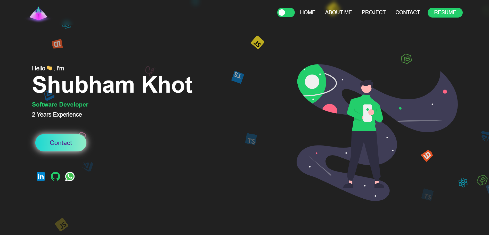
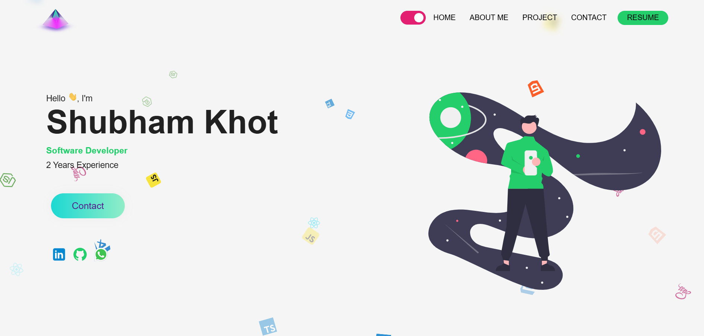

# Shubham Khot – Frontend Developer Portfolio




Welcome to my personal portfolio website! 🚀

This site is a showcase of my work, skills, and experience as a passionate Frontend Developer. Here, you'll find my featured projects, a summary of my technical stack, and ways to connect with me.

## 🛠️ Tech Stack
- **ReactJS** (with Hooks & Functional Components)
- **TypeScript**
- **Styled Components**
- **Framer Motion** (for smooth animations)
- **Formspree** (contact form integration)
- **React Toastify** (notifications)

## ✨ Features
- Responsive, modern UI
- Animated transitions and interactive elements
- Project gallery with links
- Contact form with validation and notifications
- Social media integration

## 🚀 Getting Started
Clone the repo and install dependencies:

```bash
npm install
npm run dev
```

Open [http://localhost:5173](http://localhost:5173) to view it in your browser.

## 📁 Folder Structure
- `src/components/` – Reusable UI components (Hero, About, Projects, Contact, etc.)
- `src/assets/` – Images, icons, and static assets
- `src/styles/` – Global and component styles

## 📬 Contact
Want to collaborate or have a question? Use the contact form on the site or connect with me on [LinkedIn](https://www.linkedin.com/in/shubham-khot-87398520a) or [GitHub](https://github.com/shubham465).

---

> Designed and developed by **Shubham Khot**